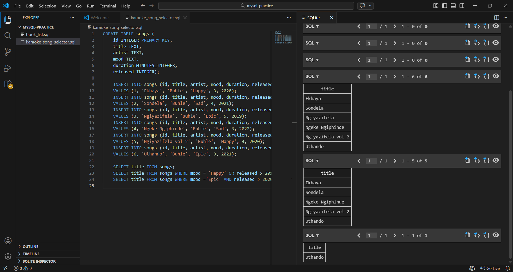

# 🎤 Karaoke Song Selector – SQL Project
# 📌 Project Overview

This project simulates a karaoke song database using SQL. It demonstrates how to retrieve and filter songs based on different conditions such as genre, release year, and duration.

The goal of the project is to practice writing structured queries and applying logical operators to refine search results.

# 🛠 Technologies Used

SQL

SQLite (or replace with MySQL/PostgreSQL if applicable)

# 📚 SQL Concepts Covered

SELECT statements

WHERE clause

Logical operators: AND, OR

Filtering data using multiple conditions

Query structuring

# 🗂 Database Structure

Example table: songs

Column Name	Description
id	Unique song ID
title	Song title
genre	Song genre
release_year	Year released
duration	Song length (in minutes)

# 💡 Example Query
SELECT title
FROM songs
WHERE genre = 'epic'
AND release_year > 1990
AND duration < 5;

This query retrieves epic songs released after 1990 that are shorter than 5 minutes.

# 🎯 Learning Outcome

Through this project, I strengthened my understanding of SQL data filtering, logical operators, and how to structure clean, readable queries.

## 📸 Sample Query Output

